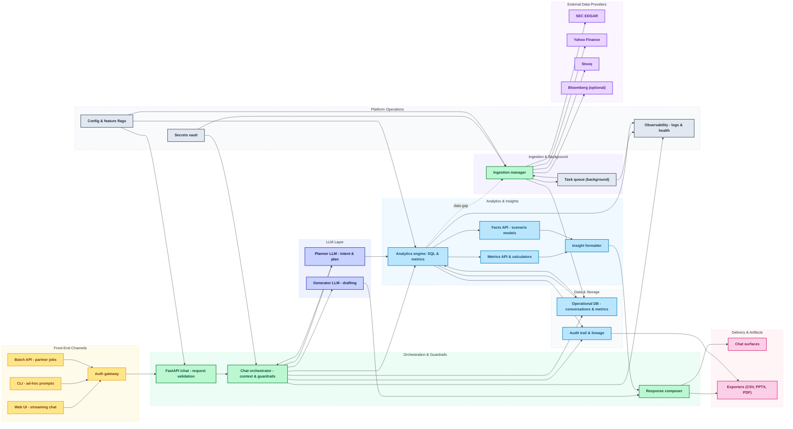

## BenchmarkOS — Architecture Overview

This document contains a high-level architecture diagram for the BenchmarkOS Analyst Copilot and short guidance mapping components to the repository.

```mermaid
flowchart LR
  %% Users and UI
  User["User Browser"]
  subgraph Frontend
    UI["SPA - Chat UI & Metrics"]
  end

  %% API / App
  subgraph API[FastAPI App]
    App[App Server (FastAPI)]
    Auth[Auth / Sessions]
    Webhook[Webhook / Integrations]
  end

  %% Workers & LLM
  subgraph Workers
    LLM[LLM Adapter / Orchestrator]
    Tasks[Background workers (ingest, index, embeddings)]
  end

  %% Data Stores
  subgraph Data
  PG["PostgreSQL + pgvector"]
  SQLite["SQLite (dev)"]
  ObjectStore["S3 / MinIO"]
  VectorStore["Chroma / Milvus / pgvector"]
  end

  %% External
  subgraph External
  LLMAPI["LLM Provider (OpenAI/Anthropic)"]
  MarketData["Market data: Yahoo, Xignite"]
  end

  User --> UI
  UI --> App
  App --> PG
  App --> ObjectStore
  App --> LLM
  LLM -.-> LLMAPI
  Tasks --> VectorStore
  Tasks --> PG
  Tasks --> ObjectStore
  App --> Tasks
  App --> MarketData

  style Frontend fill:#f8fafc,stroke:#cbd5e1
  style API fill:#ffffff,stroke:#94a3b8
  style Workers fill:#fef3c7,stroke:#f59e0b
  style Data fill:#ecfeff,stroke:#059669
  style External fill:#eef2ff,stroke:#6366f1

  click UI "../docs/orchestration_playbook.md" "Open orchestration playbook"
```


Notes
- Frontend: single-page app (current packaged static HTML in `src/benchmarkos_chatbot/static/` or a separate React/Vite app). The UI handles chat, metrics table rendering, and conversation management.
- API server: `src/benchmarkos_chatbot/web.py` (FastAPI). Hosts endpoints: `/chat`, `/metrics`, `/facts`, `/conversations`, static assets.
- Ingestion & Analytics: `src/benchmarkos_chatbot/data_ingestion.py` and `src/benchmarkos_chatbot/analytics_engine.py` implement metric extraction and indexing pipelines.
- Storage: production uses PostgreSQL (with pgvector) and S3-compatible object storage for PDFs and ingested files; local dev can use SQLite and local disk.
- Vector store / RAG: Vector index can be provided by pgvector (Postgres), Chroma, or a hosted vector DB; background workers compute embeddings and upsert documents.
- LLM orchestration: An adapter layer (LLM client) mediates between the app and model providers; streaming can be implemented with SSE or WebSockets.
- Workers: Background tasks and queues (Celery/RQ or asyncio-based workers) for ingestion, embedding, audit events, and scheduled refreshes.
- Observability & infra: Reverse proxy (Traefik/Nginx), rate-limiting, logging (structured logs + Sentry), monitoring (Prometheus + Grafana), and CI/CD pipelines (GitHub Actions).

Deployment recommendations
- Development: run FastAPI locally with `uvicorn src.benchmarkos_chatbot.web:app --reload`, use SQLite, and local static files.
- Staging/Prod: Deploy behind a reverse proxy, use PostgreSQL + pgvector, S3-compatible storage, and run workers separately. Use environment variables for secrets.
- Security: enable authentication (JWT/session), store secrets in a secret manager, and enable HTTPS at the edge.

Repository mapping
- `src/benchmarkos_chatbot/web.py` — API & static file serving
- `src/benchmarkos_chatbot/database.py` — storage helpers
- `src/benchmarkos_chatbot/analytics_engine.py` — metric extraction and summarization
- `src/benchmarkos_chatbot/data_ingestion.py` — ingestion pipelines
- `src/benchmarkos_chatbot/llm_client.py` — LLM adapter (if present)
- `src/benchmarkos_chatbot/static/` — packaged frontend assets

If you'd like, I can:
- produce a PNG/SVG export of the diagram,
- expand the diagram to include sequence diagrams (chat flow, ingestion flow), or
- tailor the diagram to a specific cloud provider (AWS/GCP/Azure) with concrete services.
# BenchmarkOS Chatbot Architecture

This workflow mirrors the product storyboard: user prompts begin on the client surfaces, traverse back-end planners and analytics engines, then return enriched responses to the chat surface.



Layer colors reinforce separation of concerns: yellow for front-end channels, green for orchestration, purple-lavender for LLM services, blue for analytics and storage, gray for platform operations, pink for delivery artifacts, and violet for external data providers.

**Interaction walk-through**
- Front-end clients (terminal, FastAPI-driven web UI, or batch API) capture a prompt and send it to the orchestrator.
- The orchestrator validates context, enriches the prompt, and delegates planning to the text-to-SQL / task LLM components.
- Planned queries execute against the financial datastore and analytics pipeline, producing structured metrics and facts.
- Result processors derive narratives, charts, and audit metadata, then package the response for the chat UI and downstream artifacts such as slides.

### Component Annotations
| Component | Layer | Responsibilities | Key Implementations |
| --- | --- | --- | --- |
| Input prompt (CLI, Web UI, API) | Front-End | Capture user questions, enforce basic validation, forward payload to orchestrator | main.py, webui/app.js, REST /chat endpoint |
| Prompt ingress | Back-End | Authenticate requests, bind conversation context, normalise prompt payloads | src/benchmarkos_chatbot/web.py::chat, BenchmarkOSChatbot |
| Plan query | Back-End / LLM | Expand prompt into structured tasks and SQL plans | src/benchmarkos_chatbot/chatbot.py::_handle_*, AnalyticsEngine.metric_value |
| Execute analytics query | Analytics | Run SQL/metric lookups, compute derived metrics, fetch facts | AnalyticsEngine.refresh_metrics, database.fetch_* |
| Analyse results | Insights / LLM | Interpret metrics, detect gaps, prepare narrative building blocks | chat_metrics.format_metrics_table, AnalyticsEngine.run_scenario |
| Package reply | Insights | Assemble narrative, tables, charts, audit links | src/benchmarkos_chatbot/web.py::chat, response composer |
| Render output & artifacts | Front-End | Stream reply to UI, generate downloads (CSV, PPTX) | webui/app.js, exporters under docs/ |

### End-to-End Timeline
1. **Conversation capture** – terminal and FastAPI entry points (main.py, /chat) serialise each prompt, attach conversation metadata, and queue it for orchestration.
2. **Guardrails & enrichment** – BenchmarkOSChatbot validates context (auth, project scope), injects previous exchanges, and enriches the prompt with defaults like base tickers or fiscal calendars.
3. **Intent planning** – specialised handlers (_metrics_, _scenario_, _ingest_) translate natural-language requests into structured tasks, leveraging the LLM planner where required.
4. **Data execution** – the analytics layer hydrates the plan: SQL runs against SQLite/Postgres, fact tables are assembled, and quote gaps trigger on-demand loaders (Yahoo Finance, Stooq).
5. **Insight generation** – numerical outputs are formatted into narratives, tabular comparisons, and guardrail notices; unresolved tickers surface suggestions or ingest prompts.
6. **Response packaging** – the orchestrator composes the final payload (narrative paragraphs, tables, chart specs, audit trails) and returns it to the caller.
7. **Artifact publishing** – the web UI renders the transcript, while optional exporters emit CSV extracts, slides, or PDF summaries for stakeholders.

### Operational Notes
- **Concurrency & scalability** – uvicorn serves the FastAPI app asynchronously; labour-intensive ingests run in the background task manager (src/benchmarkos_chatbot/tasks.py).
- **Auditability** – every prompt, metric snapshot, audit event, and scenario result is persisted via database.py, enabling replay and compliance reporting.
- **Extensibility** – LLM adapters live in llm_client.py; conforming to the LLMClient protocol allows swapping providers without touching orchestration code.
- **Reliability** – ingestion scripts (ingest_*) implement exponential backoff, checkpointing, and resumability to keep the analytics cache aligned with market filings.
