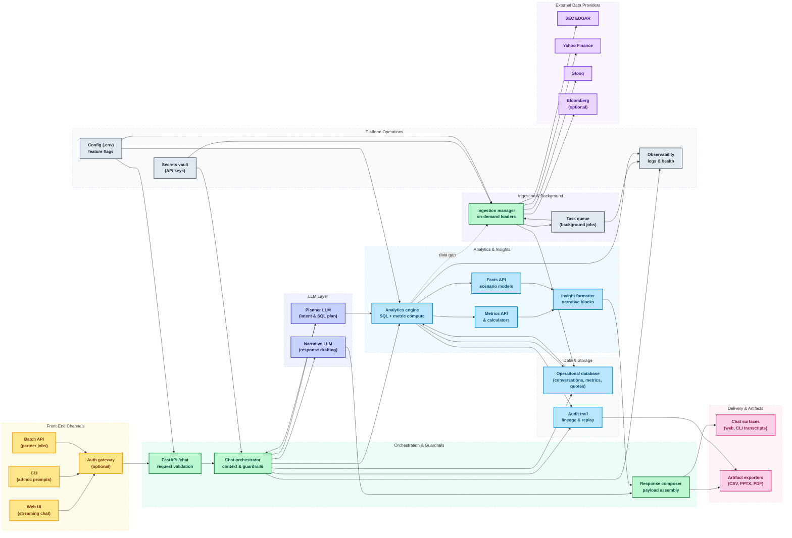

# BenchmarkOS Chatbot Architecture

This workflow mirrors the product storyboard: user prompts begin on the client surfaces, traverse back-end planners and analytics engines, then return enriched responses to the chat surface.

Layer colors reinforce separation of concerns: yellow for front-end channels, green for orchestration, purple-lavender for LLM services, blue for analytics and storage, gray for platform operations, pink for delivery artifacts, and violet for external data providers.

**Interaction walk-through**
- Front-end clients (terminal, FastAPI-driven web UI, or batch API) capture a prompt and send it to the orchestrator.
- The orchestrator validates context, enriches the prompt, and delegates planning to the text-to-SQL / task LLM components.
- Planned queries execute against the financial datastore and analytics pipeline, producing structured metrics and facts.
- Result processors derive narratives, charts, and audit metadata, then package the response for the chat UI and downstream artifacts such as slides.

### Component Annotations
| Component | Layer | Responsibilities | Key Implementations |
| --- | --- | --- | --- |
| Input prompt (CLI, Web UI, API) | Front-End | Capture user questions, enforce basic validation, forward payload to orchestrator | main.py, webui/app.js, REST /chat endpoint |
| Prompt ingress | Back-End | Authenticate requests, bind conversation context, normalise prompt payloads | src/finanlyzeos_chatbot/web.py::chat, BenchmarkOSChatbot |
| Plan query | Back-End / LLM | Expand prompt into structured tasks and SQL plans | src/finanlyzeos_chatbot/chatbot.py::_handle_*, AnalyticsEngine.metric_value |
| Execute analytics query | Analytics | Run SQL/metric lookups, compute derived metrics, fetch facts | AnalyticsEngine.refresh_metrics, database.fetch_* |
| Analyse results | Insights / LLM | Interpret metrics, detect gaps, prepare narrative building blocks | chat_metrics.format_metrics_table, AnalyticsEngine.run_scenario |
| Package reply | Insights | Assemble narrative, tables, charts, audit links | src/finanlyzeos_chatbot/web.py::chat, response composer |
| Render output & artifacts | Front-End | Stream reply to UI, generate downloads (CSV, PPTX) | webui/app.js, exporters under docs/ |

### End-to-End Timeline
1. **Conversation capture** – terminal and FastAPI entry points (main.py, /chat) serialise each prompt, attach conversation metadata, and queue it for orchestration.
2. **Guardrails & enrichment** – BenchmarkOSChatbot validates context (auth, project scope), injects previous exchanges, and enriches the prompt with defaults like base tickers or fiscal calendars.
3. **Intent planning** – specialised handlers (_metrics_, _scenario_, _ingest_) translate natural-language requests into structured tasks, leveraging the LLM planner where required.
4. **Data execution** – the analytics layer hydrates the plan: SQL runs against SQLite/Postgres, fact tables are assembled, and quote gaps trigger on-demand loaders (Yahoo Finance, Stooq).
5. **Insight generation** – numerical outputs are formatted into narratives, tabular comparisons, and guardrail notices; unresolved tickers surface suggestions or ingest prompts.
6. **Response packaging** – the orchestrator composes the final payload (narrative paragraphs, tables, chart specs, audit trails) and returns it to the caller.
7. **Artifact publishing** – the web UI renders the transcript, while optional exporters emit CSV extracts, slides, or PDF summaries for stakeholders.

### Operational Notes
- **Concurrency & scalability** – uvicorn serves the FastAPI app asynchronously; labour-intensive ingests run in the background task manager (src/finanlyzeos_chatbot/tasks.py).
- **Auditability** – every prompt, metric snapshot, audit event, and scenario result is persisted via database.py, enabling replay and compliance reporting.
- **Extensibility** – LLM adapters live in llm_client.py; conforming to the LLMClient protocol allows swapping providers without touching orchestration code.
- **Reliability** – ingestion scripts (ingest_*) implement exponential backoff, checkpointing, and resumability to keep the analytics cache aligned with market filings.
